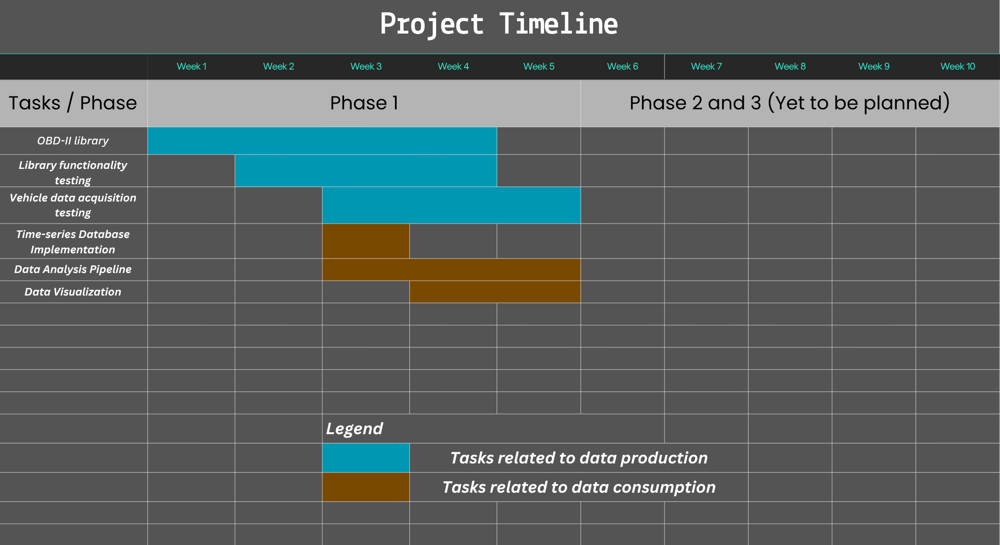
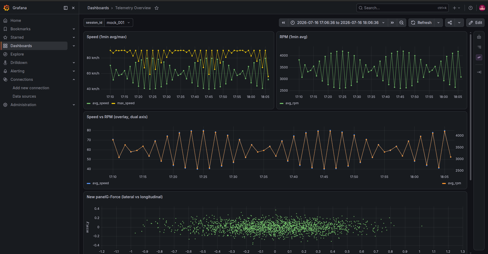

# Vehicle Telemetry Platform

An embedded edge based platform for telemetry based vehicle analysis. 

### **Important:** This project uses a custom library handling ESP32 OBD-II over CAN with support for multiframe using ISO 15765-2. This library can be found at https://github.com/BuvinduS/OBD2Lib.git

## Proposed Project Timeline (subject to change)

# Current Progress

## Phase 1 (On Going)
### Prior to week 3
- OBD-II library implementation (logic based) complete.
- Concerte implementation of MCP2515 over SPI implemented. This included serveral notable (sub) phases:
    - **Phase 1** : Established proper communication over **RAW SPI** to the MCP2515, verified wirings and crystal frequency, encountered an issue in using GPIO 11 and 10 of the ESP32-S3-devkitc-1. However pins 4 and 5 worked therefore implementation shifted to those pins. Cause of failure of pin 11 and 10 were not investigated in detail.
    - **Phase 2**: Successfully completed loopback testing in in the MCP2515. Sent test frame and recieved frame were identical, confirming proper communication. Used `autowp/arduino-mcp2515` for ease of development. Can be found at https://github.com/autowp/arduino-mcp2515.git
    - **Phase 3**: Concrete implementaion that matches `OBDTrasport` of OBD2lib. Thin wrapper around `autowp/autowp-mcp2515` 
    Note: **Real testing with an actual vehicle is yet to be confirmed, hence this section is still open.**
- Docker file created with PostgreSQL TimeScaleDB image in `analytics/`. To be moved to root level once functionality is confirmed.
- Database schema created.
- Data consumption/processing started (this repository). Uses jupyter note books and available mock data from the feasibility test to build the pipeline. Once functionality is verified will be used with actual data from a vehicle to analyse the data ot find trends, correlations etc.

### Week 3
- Implemented a db.py file to facilitate connection to the TimescaleDB (PostgreSQL timeseries database extension), utilizing environment variables for configuration. 
> This inital database connection was later refactored. See below.
- Implemented a jupyter notebook to 'explore' the data (`analytics/notebooks/01_explore.ipynb`)
    - The timescale database contains mock data. Therefore no logical implications or correlations can yet be obtained. But pipeline between the DB and the system is verified through this.
- Database connection was refactored to use SQLAlchemy and related queries where updated to facilitate this change
    - Module-level engine; SQLAlchemy engines are meant to be created once and reused (they manage their own connection pool internally), not recreated per query.
- **Grafana** dashboard implementation
    - A root level docker file was created with both Grafana and TimeScaleDB images. However the DB at `analytics/` was still used until Grafana functionality was confirmed. Therefore the timescaledb service in compose.yaml is commented out (at this sepcific time). Refactoring was done later.
    - Grafana dashboards Speed vs RPM and table for raw telemetry data was added. Separate dashboards for speed and rpm along with a G-Force map was added later. **All dashboards are running on mock data**. (See below)

    

        
         
        <em>Grafana dashboard displaying mock data</em>
    

- Defaulted to using the compose.yaml at project root by deleting the previous container and recreating at the root. Compose file inside `analytics/` is now redundant.
- Moved database schema to project root and added a continuous aggregate view. Without this continuous aggregate view new rows will not appear until an aggregate view is created manually.

#### Summary for week 3: 
Data pipeline between the DB, the analytics subsystem and Grafana is functional. Should work as intended once mock data is available since the same schema will be used system wide.

#### Could not complete/is lacking:
- Data acquisition from a real vehicle could not be started. 
- Testing the MCP2515 implementation with a vehicle could not be started.
- No logical relationships can be yet obtained from the analysis subsystem due to everything still running on mock data.

### Week 4

**Week 4 involved a schema migration**
- Sessions and telemetry decoupled from each other with the new schema.
- Telemetry database entries no longer have a associated `session_id`.
- The a new column for `node_id` was added. This is planned to correspond to the MAC address of the ESP32 which drives each telemetry node. MAC retrival is not yet implemented.
- Sessions are now purely start and end time stamps, these operate as windows over the recorded data in the telemetry database. They are used to fetch data via time range joins.
- Overlapping sessions as well as on-going sessions are allowed.
- Necessary changes made in the **Grafana**, **Analytics** subsystems to align with the database schema migration.

**Analytics sub-system**
- New `session_summary.py` script added to compute per-session telemetry statistics
- `02_session_summary.ipynb` notebook to plot graphs and analyse the the session summaries.

**Grafana sub-system**
- Dashboard JSON was updated to align with the schema migration, this simply involved chaning the raw SQL queries to facilitate a time range join.

**Web Dashboard Back-end**
- A FastAPI based back-end created with the necessary routers, to facilitate
    - Session creation, termination and viewing
    - Subscriptions to the relavant MQTT topics at `telemetry/vehicle/obd` and `telemetry/vehicle/imu` to obtain and parse the data sent.
    - WebSocket implemented for the frontend to connect, with CORS enabled.
- Ingestor implemented to feed the data in to the database.
- Both the ingestor and the FastAPI backend obtains the same data stream(via MQTT) but processes the independantly.
