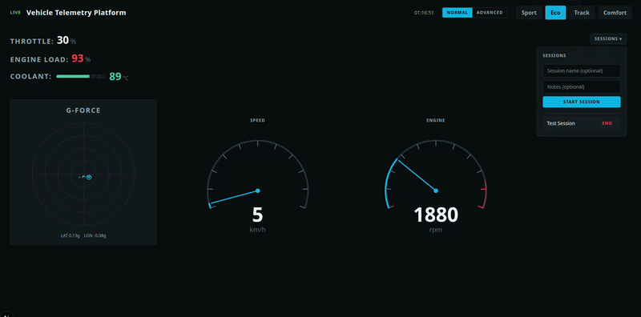
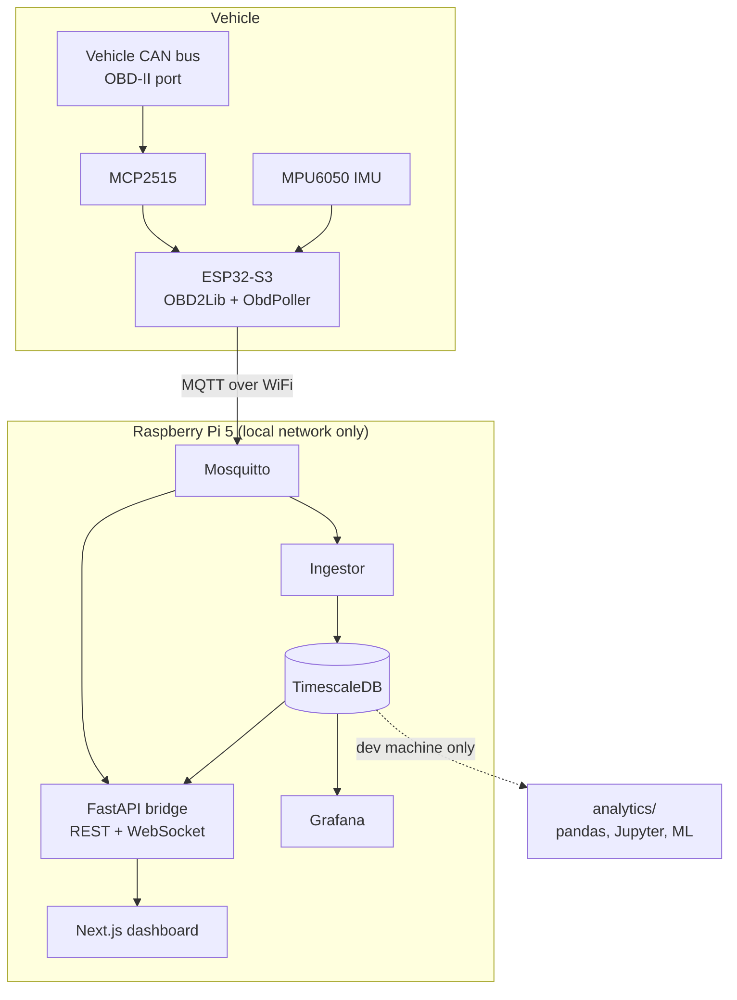

# Vehicle Telemetry Platform

A real-time, edge-based vehicle telemetry system. An ESP32 node reads OBD-II data directly from the vehicle's CAN bus, samples an IMU, and publishes both over MQTT to a Raspberry Pi. The Pi stores everything in TimescaleDB, serves a live dashboard, and provides Grafana for historical analysis. The whole stack runs on a local network with no internet or cloud required.

<p align="center">
        
        <br>
        <em>Live Dashboard</em>
    </p>
<!-- TODO: add badges if wanted (license, PlatformIO, Next.js, etc.) -->

---

## Contents

- [Features](#features)
- [System architecture](#system-architecture)
- [Hardware](#hardware)
- [Repository layout](#repository-layout)
- [Getting started (development machine)](#getting-started-development-machine)
- [Firmware](#firmware)
- [Raspberry Pi deployment](#raspberry-pi-deployment)
- [Data contracts](#data-contracts)
- [Machine learning and analytics](#machine-learning-and-analytics)
- [Testing](#testing)
- [Project status](#project-status)
- [Known limitations](#known-limitations)
- [Documentation](#documentation)
- [Datasets and acknowledgements](#datasets-and-acknowledgements)
- [License](#license)

---

## Features

**Acquisition (ESP32)**
- Direct OBD-II over CAN (ISO 15765-4, with ISO-TP for multi-frame messages) through an MCP2515 controller, using the custom [`OBD2Lib`](#obd2lib) library. No ELM327 adapter and no Bluetooth link.
- Non-blocking PID polling for speed, RPM, throttle position, coolant temperature, and engine load, alongside MPU6050 accelerometer sampling.
- Publishes at roughly 10 Hz over MQTT, with NTP-synchronised sub-second timestamps.
- Automatic IMU orientation calibration (tilt and yaw), so the unit does not need to be mounted in a fixed orientation. Calibration is persisted in NVS.
<!-- - Four status LEDs: power, WiFi, MQTT broker, and CAN/OBD link health. -->

**Live dashboard (Next.js)**
- Instrument-cluster style speed and RPM gauges, numeric readouts, a coolant temperature bar, and a G-force panel.
- Four switchable drive-mode colour schemes: Sport, Eco, Track, Comfort.
- Named sessions that can be created and ended from the UI.
- A database-backed session summary overlay (distance, idle percentage, peak G, harsh acceleration and braking counts, best 0-60).
<!-- - Renders partial data gracefully: if one PID times out, the remaining gauges keep working. -->

**Storage and analysis**
- TimescaleDB hypertable with a 1-minute continuous aggregate.
- Sessions are named time windows, so any number of overlapping sessions can reference the same underlying telemetry without storing a foreign key on every row.
- Grafana dashboards provisioned entirely from files checked into git.
- Offline analytics and an unsupervised anomaly detection experiment (Isolation Forest) in `analytics/`.

**Operations**
- One-command launcher (`dev.sh`) for the bridge, dashboard and ingestor.
- Raspberry Pi can run as its own WiFi access point, so any device in range can join and view the dashboard.
- Mock publishers and a session replay tool for developing and demoing without a vehicle.

---

## System architecture


```mermaid
flowchart TB
    subgraph Vehicle
        CAN[Vehicle CAN bus<br/>OBD-II port] --> MCP[MCP2515]
        MCP --> ESP[ESP32-S3<br/>OBD2Lib + ObdPoller]
        IMU[MPU6050 IMU] --> ESP
    end

    ESP -- "MQTT over WiFi" --> MQ

    subgraph Pi["Raspberry Pi 5 (local network only)"]
        MQ[Mosquitto]
        MQ --> ING[Ingestor]
        MQ --> BR[FastAPI bridge<br/>REST + WebSocket]
        ING --> DB[(TimescaleDB)]
        DB --> BR
        DB --> GF[Grafana]
        BR --> UI[Next.js dashboard]
    end

    DB -. "dev machine only" .-> AN[analytics/<br/>pandas, Jupyter, ML]
```

The system is organised in three tiers:

| Tier | Purpose | Notes |
|---|---|---|
| 1. Live | Real-time dashboard | Mosquitto, the FastAPI bridge and Next.js. Never depends on internet access. |
| 2. Historical | Grafana views over TimescaleDB | Provisioned from `grafana/provisioning/`. |
| 3. ML | Anomaly detection | Runs on the dev machine in `analytics/`. |

Key design decisions:

- **Direct CAN, not ELM327.** The original feasibility project used a Bluetooth ELM327 adapter and suffered RFCOMM drops, vibration-induced disconnects and serial latency. The transport was the problem, not the ELM327 chip as such. Direct CAN removes the adapter entirely.
- **MCP2515 over the ESP32's built-in TWAI peripheral**, for the more mature Arduino/PlatformIO library ecosystem. `OBD2Lib` sits behind an abstract `OBDTransport` interface, so this choice is not load-bearing for the protocol layer.
- **Acquisition is decoupled from sessions.** The ingestor writes telemetry continuously. A session is only a named `started_at` / `ended_at` window, and membership is computed with a time-range join. An open session has `ended_at IS NULL` and is treated as covering up to `NOW()`.
- **Two independent merges.** OBD and IMU arrive on separate topics. The ingestor merges them for storage (`MERGE_WINDOW`), and the bridge does a separate in-memory merge for the live view.
- **Read-only by design.** Nothing in this project writes to the vehicle (for example, Mode 04 clear-DTC is explicitly excluded).

---

## Hardware

| Component | Role |
|---|---|
| ESP32-S3-DevKitC-1 | Edge node, WiFi and MQTT publisher |
| MCP2515 SPI CAN module | CAN controller |
| MPU6050 | Accelerometer / IMU |
| OBD-II J1962 male connector | Vehicle connection (24 AWG stranded wire) |
| Raspberry Pi 5 | Edge server (Ubuntu Server 24.04, arm64) |
| Neo-6M GPS | Available, not yet integrated |

<!-- TODO: add wiring diagram / pin table (pins are declared in firmware/src/main.cpp) -->
<!-- TODO: add photos of the node and enclosure once finalised -->

Pin assignments are declared as constants directly in `firmware/src/main.cpp`. No pin definitions live inside the libraries.

---

## Repository layout

<!-- TODO: verify this tree against the actual repo before publishing -->

```
vehicle-telemetry-platform/
├── firmware/              ESP32-S3 production firmware (PlatformIO)
│   ├── src/main.cpp       Pin config, wiring of all components
│   ├── lib/               Local libs: imu_sensor, mqtt_publisher, ObdPoller,
│   │                      orientation/yaw calibration, calibration_manager, ...
│   └── test/              Native (host) unit tests, run with Unity
├── pi/
│   ├── ingestor/          MQTT to TimescaleDB writer
│   ├── dashboard/
│   │   ├── backend/       FastAPI REST + WebSocket bridge
│   │   └── frontend/      Next.js dashboard
│   ├── broker/            Mosquitto config
│   ├── mock/              Mock publishers and session replay tool
│   ├── .env.example       Per-machine config template
│   └── requirements.txt
├── db/init/               TimescaleDB schema and migrations
├── grafana/provisioning/  Datasource and dashboards as code
├── analytics/             Dev-machine-only pandas / Jupyter / ML work
├── compose.yaml           TimescaleDB, Grafana and Mosquitto containers
└── dev.sh                 One-command launcher
```

---

## Getting started (development machine)

This runs the whole stack on a laptop, with mock publishers standing in for the ESP32.

**Prerequisites:** Docker with Compose, Python 3.12, Node.js (a recent LTS or newer), and optionally PlatformIO for the firmware.

```bash
# 1. Clone
git clone https://github.com/BuvinduS/vehicle-telemetry-platform.git
cd vehicle-telemetry-platform

# 2. Per-machine config
cp pi/.env.example pi/.env        # edit as needed (for example CORS_ORIGINS)

# 3. Start TimescaleDB, Grafana and Mosquitto
docker compose up -d

# 4. Python environment for the bridge, ingestor and mocks
python3 -m venv pi/.venv
pi/.venv/bin/pip install -r pi/requirements.txt

# 5. Dashboard dependencies
(cd pi/dashboard/frontend && npm ci)

# 6. Launch the bridge, dashboard and ingestor
./dev.sh
```

Then, in separate terminals, publish mock data:

```bash
pi/.venv/bin/python pi/mock/obd_publisher.py
pi/.venv/bin/python pi/mock/imu_publisher.py
```

| Service | URL / port |
|---|---|
| Dashboard | http://localhost:3001 |
| FastAPI bridge (Swagger UI at `/docs`) | http://localhost:8000 |
| Grafana | http://localhost:3000 |
| TimescaleDB | `localhost:5433` |
| Mosquitto | `1883` (MQTT), `9001` |

Useful flags and notes:

- `./dev.sh --no-ingestor` skips the ingestor, which is handy during field tests where you do not want to persist unvalidated data.
- `./dev.sh --prod` runs the built dashboard (`next start`) and the bridge without `--reload`. Run `npm run build` in `pi/dashboard/frontend` first.
- The ingestor writes a row only when OBD data is present, so run both the OBD and IMU publishers whenever the ingestor is running.
- To replay a recorded session from the database instead of using the synthetic mocks, use `pi/mock/replay_publisher.py` (`--session-id`, `--start`, `--end`, `--speed`, `--loop`). It re-stamps `ts` to now.
- Schema changes against an existing database are applied manually (for example through DBeaver). The `db/init/` scripts only run on first initialisation of an empty volume.
- After any bulk import, refresh the continuous aggregate once:
  ```sql
  CALL refresh_continuous_aggregate('telemetry_1min', NULL, NULL);
  ```

---

## Firmware

Built with PlatformIO (VS Code works well).

```bash
cd firmware
pio run -t upload        # build and flash
pio device monitor       # serial output
```

**Configuration.** WiFi credentials and the broker address live in a gitignored `secrets.h` that `main.cpp` includes. Create it before building.

<!-- TODO: add a secrets.h.example and document the exact macro names it must define -->

When/if the broker moves, the broker address and WiFi credentials in `secrets.h` are the only firmware change needed.

### OBD2Lib

`OBD2Lib` is a standalone PlatformIO library implementing OBD-II over CAN, consumed as a tagged git dependency:

```ini
lib_deps = https://github.com/BuvinduS/OBD2Lib#v0.1.2
```

<!-- TODO: confirm the tag you want to pin -->

- Mode 01 core PIDs and Mode 09 VIN (with full ISO-TP multi-frame reassembly).
- PID support discovery.
- Non-blocking `requestPID()` / `update()` / `getResult()` API, plus a blocking `queryPID()`.
- Abstract `OBDTransport` with a shipped `MockTransport` and a concrete `MCP2515Transport`.
- Hardware-validated against real vehicle CAN buses.

<!-- See [`docs/OBD2Lib-reference.md`](docs/OBD2Lib-reference.md) for the full API and design notes. -->

### IMU calibration

The node learns its own mounting orientation in two stages, with no manual alignment:

1. **Tilt**, from the gravity vector while stationary.
2. **Yaw**, from the direction of acceleration events compared against acceleration derived from OBD speed. A pooled heading estimator handles diagonal mounts.

The result is stored in NVS. A stale-tilt guard re-learns the calibration if the unit is remounted. The pipeline is split into small native-testable libraries under `firmware/lib/`.

<!-- ### Status LEDs

| LED | Meaning |
|---|---|
| Power | Wired to the supply rail |
| WiFi | Connected to the access point |
| MQTT | Connected to the broker |
| CAN / OBD | Link healthy (goes off after consecutive PID timeouts) |

--- -->

## Raspberry Pi deployment

The reference target is a Raspberry Pi 5 running Ubuntu Server 24.04 (arm64) with Docker and Compose installed. The Pi runs the entire stack by itself, with no internet access needed at the demo.

**Install.** Follow the same steps as the [development setup](#getting-started-development-machine). Pin the container images to the versions used in development (TimescaleDB 2.28.1 on PostgreSQL 16, Grafana 13.1.0). Mosquitto uses the floating `eclipse-mosquitto:2` tag.

**Per-machine config.** Settings such as `CORS_ORIGINS` (comma-separated) live in the gitignored `pi/.env`, which `dev.sh` sources. Include every origin the dashboard is served from, for example `http://<pi-address>:3001`.

**Autostart.** `dev.sh --prod` exits non-zero if any service dies, so systemd can restart the whole stack. Example unit (adapt paths and user):

```ini
# /etc/systemd/system/vtp.service
[Unit]
Description=Vehicle Telemetry Platform
After=docker.service
Requires=docker.service

[Service]
User=<user>
WorkingDirectory=/home/<user>/vehicle-telemetry-platform
ExecStart=/home/<user>/vehicle-telemetry-platform/dev.sh --prod
Restart=on-failure

[Install]
WantedBy=multi-user.target
```

```bash
sudo systemctl enable --now vtp.service
```

**Pi as a WiFi access point.** The Pi creates its own WPA2 network so no phone hotspot is needed and any device in range can open the dashboard.

- Configured through NetworkManager, with the Pi at a fixed address (the reference setup uses `10.42.0.1`) and the dashboard at `http://10.42.0.1:3001`.
- The ESP32 firmware's SSID, password and broker address point at this network.
- The ESP32 has no RTC and syncs time over NTP. In AP mode the Pi runs `chrony` to serve time, and the AP answers `pool.ntp.org` lookups with the Pi's own address, so the firmware needs no change.
- A small helper script on the Pi can switch it between AP mode and a client network (for `git pull`, builds and fixes), then back to AP mode on the next boot.

<!-- TODO: decide whether to commit the AP setup commands and the network helper script to the repo, and link them here -->
<!-- TODO: QR code for guests to join the AP and open the dashboard (if built) -->

---

## Data contracts

### MQTT

| Topic | Publisher | Rate | Purpose |
|---|---|---|---|
| `telemetry/vehicle/obd` | ESP32 | ~10 Hz (normal) | OBD-II data |
| `telemetry/vehicle/imu` | ESP32 | ~10 Hz | Calibrated accelerometer data |
<!-- | `telemetry/vehicle/info` | ESP32 | once per connection | Vehicle identification |
| `telemetry/vehicle/gps` | ESP32 | not yet implemented | Position data |
| `telemetry/control` | Bridge | on user action | Mode switch | -->

Payloads carry no session information. Missing values are sent as explicit `null` rather than omitted, so consumers must render partial data.

```json
// telemetry/vehicle/obd
{
  "ts": 1719123456.789,
  "mode": "normal",
  "speed_kmh": 65.7,
  "rpm": 2240,
  "throttle_pct": 38.0,
  "coolant_temp_c": 85.5,
  "engine_load_pct": 30.4
}

// telemetry/vehicle/imu  (m/s^2)
{ "ts": 1719123456.789, "accel_x": 0.331, "accel_y": -0.240, "accel_z": 11.051 }
```

Full details: [`docs/mqtt-topics.md`](docs/mqtt-topics.md).

### REST and WebSocket (FastAPI bridge)

| Endpoint | Description |
|---|---|
| `POST /sessions` | Create an open session (all fields optional) |
| `POST /sessions/{id}/end` | End a session (sets `ended_at`) |
| `GET /sessions/{id}` | Fetch one session |
| `GET /sessions/active` | List currently open sessions |
| `GET /sessions` | List sessions |
| `GET /sessions/{id}/summary` | Database-backed drive summary |
| `WS /ws/telemetry` | Live stream: `telemetry`, `active_sessions` and `advanced_pids` messages |

Timestamps in REST responses are converted to `Asia/Colombo` for display. Storage is always UTC (`TIMESTAMPTZ`). Interactive docs are at `/docs`.

<!-- TODO: GET /sessions and /sessions/{id}/summary are not yet in api-reference.md; update it and confirm this table -->

<!-- Full details: [`docs/api-reference.md`](docs/api-reference.md). -->

### Database

| Table | Purpose |
|---|---|
| `telemetry` | Hypertable of merged OBD and IMU rows (GPS columns exist but are unpopulated) |
| `sessions` | Named time windows (`started_at`, nullable `ended_at`) |
| `drivers` | Driver metadata |
| `nodes` | ESP32 units, identified by MAC address (schema only; multi-node ingestion is not built) |
| `telemetry_1min` | Continuous aggregate with a 5-minute refresh policy |

Session membership is a time-range join:

```sql
SELECT t.*
FROM telemetry t
JOIN sessions s
  ON t.time BETWEEN s.started_at AND COALESCE(s.ended_at, NOW())
WHERE s.id = '<session-id>';
```

<!-- Full details: [`docs/schema-reference.md`](docs/schema-reference.md). -->

---

## Machine learning and analytics

`analytics/` is permanently dev-machine-only. It holds exploratory pandas and Jupyter work and the anomaly detection experiments.

- **Approach:** unsupervised anomaly detection with an Isolation Forest. There is no labelled fault data, so the goal is to check that data collected by this platform looks plausible against real automotive telemetry, not to predict failures.
- **Baseline:** trained on the KIT/RADAR dataset and validated with synthetic fault injection. It detected both injected fault types at a calibrated 2% false-positive rate on a sealed test set. Synthetic faults are a controlled sensitivity test, not real fault data.
- **Finding:** population models did not transfer to this project's own hybrid vehicle, and a magnitude mismatch in engine load explained the gap. The design therefore moved to **per-vehicle models**, with VED-trained population models kept as cold-start priors.
<!-- - **Status:** the per-vehicle volume-sweep experiment is paused; see [`docs/model_details.md`](docs/model_details.md) for methodology, results and limitations. -->

Anomaly scoring is not part of the live dashboard. Surfacing it in Grafana is a planned follow-up.

---

## Testing

```bash
# Firmware logic (host, no hardware needed)
cd firmware && pio test -e native

# Dashboard type check
cd pi/dashboard/frontend && npx tsc --noEmit
```

`OBD2Lib` has its own native Unity suites (parsing, ISO-TP, PID support) built against `MockTransport`. The mock publishers and the replay tool allow an end-to-end test of the whole pipeline without a vehicle.

---

## Project status

| Area | Status |
|---|---|
| OBD2Lib over MCP2515 | Complete, validated on real vehicles |
| ESP32 firmware (OBD + IMU + MQTT + NTP) | Complete, field-validated |
| Automatic IMU calibration | Working; field-tested, tuning ongoing |
| Ingestor, bridge, TimescaleDB, Grafana | Complete |
| Live dashboard and session summary | Complete; mobile layout in progress |
| Pi deployment (autostart, access point) | Working with mock data and the live ESP32 |
| Per-vehicle anomaly detection | Paused mid-investigation |
| GPS integration (Neo-6M) | Designed, not implemented |
| SD card logging on the ESP32 | Not designed |
| Extra PIDs (for example fuel level) | Deferred |
| Cloud proof of concept | Planned, Pi version stays primary |
| Authentication and TLS | Out of scope for now |

Measured acquisition performance across three different vehicles: roughly 10 Hz cadence and about 95 to 98 percent per-PID read completeness.

---

## Known limitations

- Only standard Mode 01 PIDs and Mode 09 VIN are supported. No DTC (Mode 03/06/07/0A) reading, and no manufacturer-specific PIDs.
- IMU axes are only meaningful after calibration reaches the ready state. The G-force pointer is somewhat noisy while stationary, and a 10 Hz hardware low-pass filter is the current mitigation.
- The throttle PID reports throttle-plate angle, which on drive-by-wire vehicles does not track driver input. Accelerator pedal position (PID 0x49/0x4A) is a candidate for later.
- Single-vehicle assumption: the `nodes` table exists, but multi-node ingestion and registration are not built.
- No authentication or TLS. Use it on a trusted local network.
- Anomaly models are validated on synthetic faults only.
- Speed read from OBD can differ from the vehicle's own speedometer, which is commonly calibrated to over-read.

<!-- --- -->

<!-- ## Documentation -->

<!-- TODO: confirm these files are under docs/ in the repo, or adjust the links -->

<!-- | Document | Contents |
|---|---|
| [`docs/architecture.md`](docs/architecture.md) | Design decisions, open questions, scope |
| [`docs/OBD2Lib-reference.md`](docs/OBD2Lib-reference.md) | Library API, design decisions, hardware bring-up notes |
| [`docs/mqtt-topics.md`](docs/mqtt-topics.md) | Topics and payload shapes |
| [`docs/api-reference.md`](docs/api-reference.md) | REST and WebSocket contract |
| [`docs/schema-reference.md`](docs/schema-reference.md) | Database schema and migrations |
| [`docs/model_details.md`](docs/model_details.md) | Anomaly detection methodology and results |
| [`docs/lessons-learned.md`](docs/lessons-learned.md) | Gotchas and hard-won findings | -->

---

## Datasets and acknowledgements

- **KIT/RADAR Automotive OBD-II Dataset**, DOI [10.35097/1130](https://doi.org/10.35097/1130).
- **VED (Vehicle Energy Dataset)**, University of Michigan, Apache 2.0.
- Built on [`autowp/arduino-mcp2515`](https://github.com/autowp/arduino-mcp2515) for the CAN controller driver, and on SAE J1979 / ISO 15031-5 for the OBD-II PID definitions.

This project began as a feasibility study, which validated the Pi, MQTT, TimescaleDB and Next.js pipeline using a Bluetooth ELM327 adapter.

<!-- TODO: add supervisor / university acknowledgements and any paper or poster citation -->

---

<!-- ## License -->

<!-- TODO: choose a license and add a LICENSE file. Note the VED dataset is Apache 2.0 and the KIT dataset has its own terms. -->